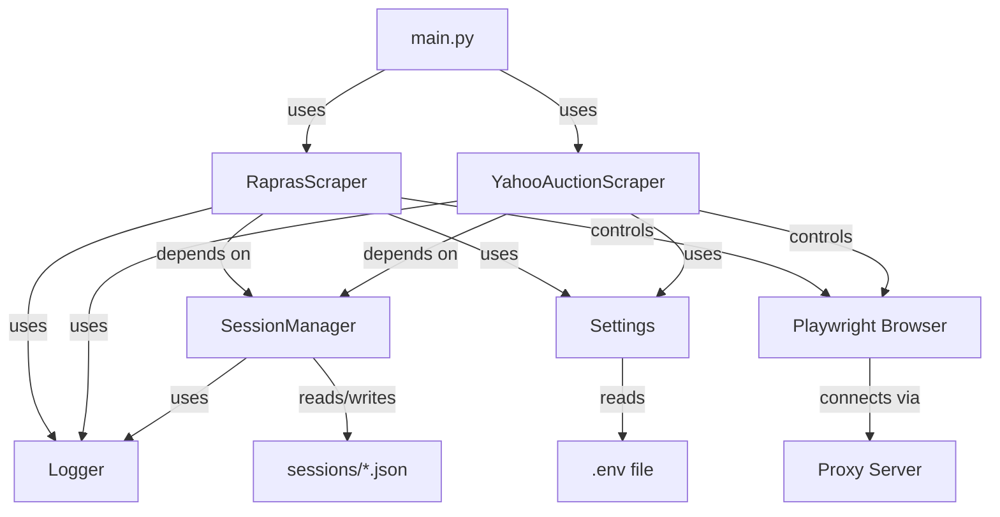

# Design Document

## Overview

Rapras（https://www.rapras.jp/）とYahoo Auctions（https://auctions.yahoo.co.jp/）への認証を自動化するシステムを設計します。Playwrightを使用したブラウザ自動化により、以下の認証フローを実装します：

1. **Rapras認証**: ユーザー名・パスワード認証
2. **Yahoo Auctions認証**: 電話番号・SMS認証（プロキシBASIC認証経由）
3. **セッション管理**: Cookie永続化による再利用

本機能は、セラーデータ収集機能の前提条件となる基盤インフラストラクチャです。

## Steering Document Alignment

### Technical Standards (tech.md)

- **Primary Language**: Python 3.12+
- **Key Dependencies**:
  - Playwright: ブラウザ自動化・SMS認証対応
  - Python標準ライブラリ: json（Cookie保存）、os（環境変数読み込み）
- **Environment Setup**: `.venv/` ローカル仮想環境
- **Code Quality**:
  - Black: コードフォーマット
  - Ruff: リンティング・import整理
  - pytest: テストフレームワーク（カバレッジ80%以上必須）

### Project Structure (structure.md)

```
modules/
├── scraper/
│   ├── rapras_scraper.py       # RaprasScraper クラス
│   ├── yahoo_scraper.py        # YahooAuctionScraper クラス
│   └── session_manager.py      # SessionManager クラス
├── config/
│   ├── settings.py             # 環境変数読み込み
│   └── constants.py            # 定数定義
└── utils/
    └── logger.py               # ログ設定
```

**Naming Conventions**:
- Classes: `PascalCase` (例: `RaprasScraper`)
- Functions/Methods: `snake_case` (例: `login_rapras()`)
- Constants: `UPPER_SNAKE_CASE` (例: `MAX_RETRY_ATTEMPTS`)
- Private Methods: `_snake_case` (例: `_validate_credentials()`)

## Code Reuse Analysis

### Existing Components to Leverage

現時点ではプロジェクト初期段階のため、既存コンポーネントはありません。以下の新規コンポーネントを実装します：

- **SessionManager**: Cookie管理の基盤クラス（将来的に他のスクレイパーでも再利用可能）
- **Logger**: 統一ログ出力（`modules/utils/logger.py`）
- **Settings**: 環境変数管理（`modules/config/settings.py`）

### Integration Points

- **Playwright**: ブラウザ自動化エンジン
  - インストール: `playwright install chromium`
  - プロキシ設定: コンテキスト作成時にBASIC認証情報を含むプロキシを設定
- **.envファイル**: 認証情報管理
  - `RAPRAS_USERNAME`, `RAPRAS_PASSWORD`
  - `YAHOO_PHONE_NUMBER`
  - `PROXY_URL`, `PROXY_USERNAME`, `PROXY_PASSWORD`
- **Cookie Storage**: ローカルファイルシステム
  - `sessions/rapras_session.json`
  - `sessions/yahoo_session.json`

## Architecture

### Modular Design Principles

- **Single File Responsibility**:
  - `rapras_scraper.py`: Rapras認証のみ
  - `yahoo_scraper.py`: Yahoo Auctions認証のみ
  - `session_manager.py`: Cookie管理のみ
- **Component Isolation**: 各Scraperクラスは独立して動作可能
- **Service Layer Separation**:
  - スクレイピング層（Scraper）
  - セッション管理層（SessionManager）
  - 設定層（Config）
- **Utility Modularity**: Logger、Settingsは汎用的な単一目的モジュール



## Components and Interfaces

### Component 1: RaprasScraper

- **Purpose**: Raprasサイトへのユーザー名・パスワード認証を自動化
- **File**: `modules/scraper/rapras_scraper.py`
- **Interfaces**:
  ```python
  class RaprasScraper:
      def __init__(self, session_manager: SessionManager) -> None:
          """初期化：SessionManagerを依存注入"""

      async def login(self, username: str, password: str) -> bool:
          """Raprasにログイン

          Args:
              username: Raprasユーザー名
              password: Raprasパスワード

          Returns:
              ログイン成功時True、失敗時False

          Raises:
              LoginError: ログイン処理に失敗した場合
              TimeoutError: タイムアウト（30秒）が発生した場合
          """

      async def is_logged_in(self) -> bool:
          """ログイン状態を確認"""

      async def close(self) -> None:
          """ブラウザセッションを閉じる"""
  ```
- **Dependencies**:
  - `SessionManager`: セッションCookie管理
  - `Settings`: 環境変数読み込み
  - `Logger`: ログ出力
  - `Playwright`: ブラウザ制御
- **Reuses**: なし（新規実装）

### Component 2: YahooAuctionScraper

- **Purpose**: Yahoo Auctionsへの電話番号・SMS認証を自動化（プロキシBASIC認証経由）
- **File**: `modules/scraper/yahoo_scraper.py`
- **Interfaces**:
  ```python
  class YahooAuctionScraper:
      def __init__(self, session_manager: SessionManager, proxy_config: dict) -> None:
          """初期化：SessionManagerとプロキシ設定を依存注入

          Args:
              session_manager: Cookie管理
              proxy_config: {"server": "...", "username": "...", "password": "..."}
          """

      async def login(self, phone_number: str) -> bool:
          """Yahoo Auctionsにログイン（SMS認証）

          Args:
              phone_number: ログイン用電話番号

          Returns:
              ログイン成功時True、失敗時False

          Raises:
              ProxyAuthenticationError: プロキシ認証失敗
              LoginError: ログイン処理に失敗した場合
              TimeoutError: タイムアウト（30秒）が発生した場合
          """

      async def is_logged_in(self) -> bool:
          """ログイン状態を確認"""

      async def close(self) -> None:
          """ブラウザセッションを閉じる"""
  ```
- **Dependencies**:
  - `SessionManager`: セッションCookie管理
  - `Settings`: 環境変数読み込み
  - `Logger`: ログ出力
  - `Playwright`: ブラウザ制御（プロキシ設定含む）
- **Reuses**: なし（新規実装）

### Component 3: SessionManager

- **Purpose**: Cookie永続化・復元によるセッション管理
- **File**: `modules/scraper/session_manager.py`
- **Interfaces**:
  ```python
  class SessionManager:
      def __init__(self, session_dir: str = "sessions") -> None:
          """初期化：セッションファイル保存ディレクトリを指定"""

      def save_session(self, service_name: str, cookies: list[dict]) -> None:
          """セッションCookieをファイルに保存

          Args:
              service_name: サービス名（"rapras" or "yahoo"）
              cookies: Playwrightから取得したCookieリスト

          Raises:
              IOError: ファイル書き込み失敗時（警告ログ出力）
          """

      def load_session(self, service_name: str) -> list[dict] | None:
          """セッションCookieをファイルから読み込み

          Args:
              service_name: サービス名（"rapras" or "yahoo"）

          Returns:
              Cookieリスト、ファイルが存在しない場合はNone

          Raises:
              JSONDecodeError: ファイル破損時（警告ログ出力、Noneを返す）
          """

      def session_exists(self, service_name: str) -> bool:
          """セッションファイルの存在確認"""

      def delete_session(self, service_name: str) -> None:
          """セッションファイルを削除"""
  ```
- **Dependencies**:
  - `json`: Cookie serialization/deserialization
  - `pathlib`: ファイルパス操作
  - `Logger`: ログ出力
- **Reuses**: なし（新規実装）

### Component 4: Settings

- **Purpose**: 環境変数の一元管理
- **File**: `modules/config/settings.py`
- **Interfaces**:
  ```python
  from dataclasses import dataclass

  @dataclass
  class RaprasConfig:
      username: str
      password: str

  @dataclass
  class YahooConfig:
      phone_number: str

  @dataclass
  class ProxyConfig:
      url: str
      username: str
      password: str

  def load_rapras_config() -> RaprasConfig:
      """Rapras認証情報を.envから読み込み"""

  def load_yahoo_config() -> YahooConfig:
      """Yahoo認証情報を.envから読み込み"""

  def load_proxy_config() -> ProxyConfig:
      """プロキシ設定を.envから読み込み"""
  ```
- **Dependencies**:
  - `os`: 環境変数読み込み
  - `dataclasses`: 設定クラス定義
- **Reuses**: なし（新規実装）

### Component 5: Logger

- **Purpose**: 統一されたログ出力
- **File**: `modules/utils/logger.py`
- **Interfaces**:
  ```python
  import logging

  def get_logger(name: str) -> logging.Logger:
      """モジュール用Loggerを取得

      Args:
          name: モジュール名（通常は__name__）

      Returns:
          設定済みLogger（INFO/WARNING/ERROR）
      """
  ```
- **Dependencies**:
  - `logging`: Python標準ライブラリ
- **Reuses**: なし（新規実装）

## Data Models

### Cookie Model

Playwrightが提供するCookie形式をそのまま使用：

```python
# Playwright Cookie Format (list of dicts)
[
    {
        "name": "session_id",
        "value": "abc123...",
        "domain": ".rapras.jp",
        "path": "/",
        "expires": 1234567890.0,  # Unix timestamp
        "httpOnly": True,
        "secure": True,
        "sameSite": "Lax"
    },
    # ... more cookies
]
```

### Configuration Models

```python
@dataclass
class RaprasConfig:
    username: str  # Raprasユーザー名
    password: str  # Raprasパスワード

@dataclass
class YahooConfig:
    phone_number: str  # Yahoo電話番号（例: "09012345678"）

@dataclass
class ProxyConfig:
    url: str        # プロキシURL（例: "http://164.70.96.2:3128"）
    username: str   # プロキシBASIC認証ユーザー名
    password: str   # プロキシBASIC認証パスワード
```

## Error Handling

### Error Scenarios

1. **ネットワーク接続エラー**
   - **Handling**:
     - 最大3回リトライ（指数バックオフ: 2秒, 4秒, 8秒）
     - 3回失敗後は`ConnectionError`を発生
   - **User Impact**:
     - エラーログ出力: "Network connection failed after 3 retries"
     - 処理中断

2. **プロキシ認証失敗**
   - **Handling**:
     - `ProxyAuthenticationError`を発生（リトライなし）
     - エラーログに詳細を記録（認証情報は含めない）
   - **User Impact**:
     - エラーメッセージ: "Proxy authentication failed. Please check PROXY_USERNAME and PROXY_PASSWORD in .env"

3. **ログイン失敗（認証情報誤り）**
   - **Handling**:
     - 最大3回リトライ
     - 3回失敗後は`LoginError`を発生
   - **User Impact**:
     - エラーメッセージ: "Login failed after 3 attempts. Please check credentials in .env"

4. **タイムアウト（30秒超過）**
   - **Handling**:
     - `TimeoutError`を発生
     - 自動リトライ（最大3回）
   - **User Impact**:
     - 警告ログ: "Timeout occurred, retrying... (attempt 1/3)"

5. **セッションファイル破損**
   - **Handling**:
     - 警告ログを出力
     - Noneを返して新規ログインフローに移行
   - **User Impact**:
     - 警告メッセージ: "Session file corrupted, starting fresh login"

6. **SMS認証コード入力タイムアウト**
   - **Handling**:
     - ユーザー入力待機（最大3分）
     - タイムアウト後は`TimeoutError`を発生
   - **User Impact**:
     - プロンプト: "Please enter SMS code (timeout in 3 minutes): "
     - タイムアウト時: "SMS code input timeout. Please try again."

## Testing Strategy

### Unit Testing

- **Approach**: pytest + pytest-asyncio
- **Key Components**:
  1. **SessionManager**:
     - `test_save_session_success()`: Cookie正常保存
     - `test_load_session_success()`: Cookie正常読み込み
     - `test_load_session_file_not_found()`: ファイル不在時None返却
     - `test_load_session_corrupted_json()`: JSON破損時の警告ログ
     - `test_session_exists()`: 存在確認
     - `test_delete_session()`: ファイル削除

  2. **Settings**:
     - `test_load_rapras_config()`: Rapras設定読み込み
     - `test_load_yahoo_config()`: Yahoo設定読み込み
     - `test_load_proxy_config()`: プロキシ設定読み込み
     - `test_missing_env_vars()`: 環境変数不在時の例外

  3. **RaprasScraper**（モック使用）:
     - `test_login_success()`: ログイン成功
     - `test_login_failure_invalid_credentials()`: 認証情報誤り
     - `test_login_retry_on_network_error()`: ネットワークエラーリトライ
     - `test_login_timeout()`: タイムアウト処理

  4. **YahooAuctionScraper**（モック使用）:
     - `test_login_success_with_proxy()`: プロキシ経由ログイン成功
     - `test_proxy_authentication_error()`: プロキシ認証失敗
     - `test_sms_code_input_success()`: SMS認証成功
     - `test_sms_code_input_timeout()`: SMS入力タイムアウト

### Integration Testing

- **Approach**: Playwright実環境テスト（手動実行）
- **Key Flows**:
  1. **Rapras認証フロー**:
     - `.env`設定 → `RaprasScraper.login()` → セッション保存 → 次回起動時にセッション復元

  2. **Yahoo Auctions認証フロー**:
     - プロキシ設定 → `YahooAuctionScraper.login()` → SMS入力待機 → セッション保存

  3. **セッション有効期限切れ**:
     - 期限切れCookieロード → 自動再ログイン → 新しいセッション保存

### End-to-End Testing

- **Approach**: 実際のRapras・Yahoo Auctionsサイトを使用したE2Eテスト
- **User Scenarios**:
  1. **初回ログインシナリオ**:
     - セッション不在 → Raprasログイン → Yahooログイン（SMS入力） → データ収集開始

  2. **セッション再利用シナリオ**:
     - 既存セッション読み込み → ログインスキップ → データ収集開始

  3. **エラーリカバリシナリオ**:
     - ネットワークエラー → 自動リトライ → 成功

### Test Coverage Requirements

- **Minimum**: 80%（tech.md準拠）
- **Target**: 分岐網羅率（Branch Coverage）100%
- **Execution**: `pytest --cov=modules --cov-report=html --cov-report=term-missing`
