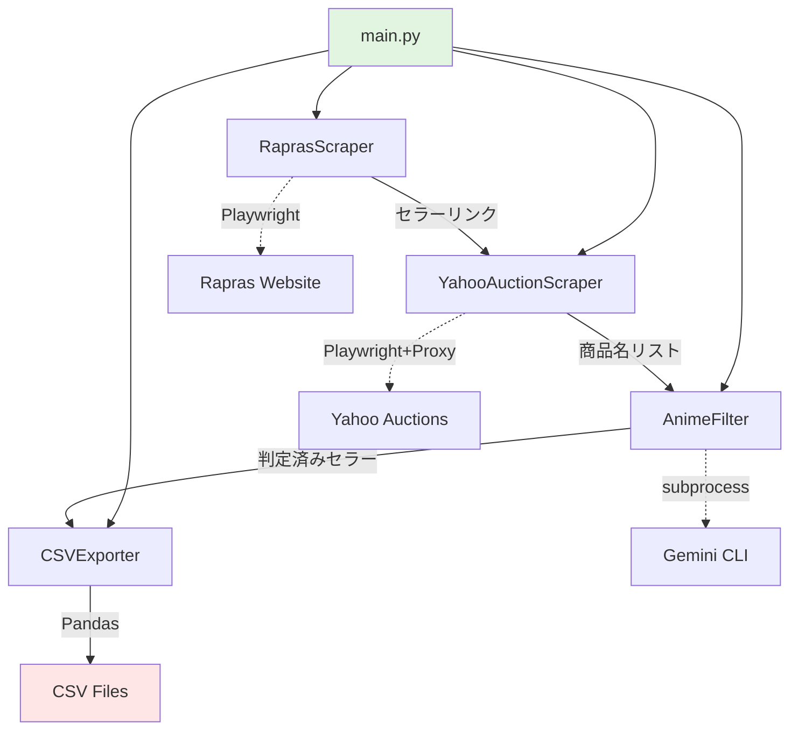

# Design Document

## Overview

Seller Data Collection Analysis機能は、Raprasの集計ページからYahoo Auctionsのセラー情報を収集し、アニメタイトル判定を通じて二次創作セラーを自動識別するシステムです。本機能は以下の4つの主要コンポーネントで構成されます:

1. **Scraper Layer**: Rapras/Yahoo Auctionsからのデータ収集
2. **Analyzer Layer**: アニメタイトル判定による二次創作セラー特定
3. **Storage Layer**: CSV形式でのデータエクスポート
4. **CLI Layer**: ユーザーインターフェースとオーケストレーション

本設計は、product.mdで定義された「セラーデータ収集・分析・CSVエクスポート」と「アニメタイトルフィルタリング」機能を実現し、以下のCritical Success Criteriaを満たします:

- **Data Extraction Accuracy**: 100%
- **Connection Success Rate**: 100%
- **Processing Speed**: 1セラーあたり30秒以下

## Steering Document Alignment

### Technical Standards (tech.md)

本設計は以下のtech.mdの技術標準に準拠します:

#### 技術スタック
- **Primary Language**: Python 3.12+
- **Web Scraping**: Playwright（ブラウザ自動化）
- **Data Processing**: Pandas（CSV操作）
- **External Integration**:
  - Gemini CLI (`gemini -m "gemini-2.5-flash" -p "$PROMPT"`) でアニメタイトル判定
  - Yahoo Auctions Proxy (`http://164.70.96.2:3128`)

#### 品質基準
- **Test Coverage**: 90%以上（pytest-cov）
- **Code Quality**: Black（フォーマット） + Ruff（リント）
- **Security**: bandit, safety による脆弱性スキャン

#### パフォーマンス要件
- **Scraping Speed**: 1セラーあたり30秒以下
- **Parallel Processing**: 最大3並列でセラー処理

### Project Structure (structure.md)

本実装は以下のstructure.mdのディレクトリ構成に従います:

```
modules/
├── scraper/
│   ├── rapras_scraper.py      # RaprasScraper: 集計ページからセラーリンク取得
│   └── yahoo_scraper.py       # YahooAuctionScraper: セラーページから商品名取得
├── analyzer/
│   └── anime_filter.py        # AnimeFilter: Gemini CLIでアニメタイトル判定
├── storage/
│   ├── csv_exporter.py        # CSVExporter: CSV出力
│   └── models.py              # Product, Sellerデータモデル
├── config/
│   ├── settings.py            # 環境変数（RAPRAS_USERNAME, RAPRAS_PASSWORD, Yahoo Proxy設定）
│   └── constants.py           # MAX_PRODUCTS_PER_SELLER=12, MIN_SELLER_PRICE=100000等
└── utils/
    └── logger.py              # ロギング設定
```

**命名規則遵守**:
- クラス: `PascalCase`（RaprasScraper, AnimeFilter）
- 関数: `snake_case`（fetch_seller_links, is_anime_title）
- 定数: `UPPER_SNAKE_CASE`（MAX_RETRY_ATTEMPTS, TIMEOUT_SECONDS）

## Code Reuse Analysis

**新規プロジェクトのため既存コードは存在しません**が、以下のパターンを採用します:

### 設計パターン
- **Strategy Pattern**: Scraper（Rapras/Yahoo）の抽象化
- **Repository Pattern**: CSVExporterによるデータ永続化
- **Dependency Injection**: Constructor injectionでテスタビリティ確保

### 外部依存
- **Playwright**: `playwright install chromium` で事前インストール
- **Gemini CLI**: システムにインストール済みと仮定（`which gemini`で確認）
- **Pandas**: CSV操作のための標準ライブラリ

### Integration Points
- **Rapras**: `https://www.rapras.jp/sum_analyse?target=epsum&updown=down&genre=all&sdate=YYYY-MM-DD&edate=YYYY-MM-DD`
- **Yahoo Auctions**: Proxy経由でアクセス（`http://164.70.96.2:3128`）
- **Gemini CLI**: `subprocess.run()` でコマンド実行

## Architecture

### 全体アーキテクチャ



### データフロー

1. **Raprasログイン & セラーリンク取得** (RaprasScraper)
   - Input: 対象期間（sdate, edate）
   - Process: Rapras集計ページをスクレイピング、落札価格≥10万円のセラーを抽出
   - Output: セラーリンクリスト（Yahoo Auctions URL）

2. **Yahoo Auctions商品名取得** (YahooAuctionScraper)
   - Input: セラーリンク
   - Process: プロキシ経由でセラーページにアクセス、上から最大12件の商品名を取得
   - Output: セラー情報（名前、URL、商品名リスト）

3. **中間CSVエクスポート** (CSVExporter)
   - Input: セラー情報リスト
   - Output: `sellers_{timestamp}.csv`（二次創作="未判定"）

4. **アニメタイトル判定** (AnimeFilter)
   - Input: 商品名リスト
   - Process:
     - 各商品名から先頭2単語を抽出
     - Gemini CLIで「このタイトルはアニメ作品ですか？」を問い合わせ
     - 1件でも「はい」なら該当セラーを「二次創作」認定し、残り商品をスキップ
   - Output: 判定済みセラーリスト

5. **最終CSVエクスポート** (CSVExporter)
   - Input: 判定済みセラーリスト
   - Output: `sellers_{timestamp}_final.csv`（二次創作="はい"/"いいえ"）

### モジュール間依存関係

```
┌─────────────────────────┐
│      main.py (CLI)      │ ← エントリーポイント
└────────────┬────────────┘
             │
      ┌──────┴──────────────┐
      ▼                      ▼
┌──────────────┐      ┌───────────────┐
│   Scraper    │      │   Analyzer    │
│  - Rapras    │      │ - AnimeFilter │
│  - Yahoo     │      └───────┬───────┘
└──────┬───────┘              │
       │                      │
       └──────────┬───────────┘
                  ▼
           ┌─────────────┐
           │   Storage   │
           │  - CSV      │
           │  - Models   │
           └─────────────┘
```

**依存関係ルール**:
- Scraperは外部サイトのみに依存
- Analyzerは入力データ（商品名）のみに依存
- Storageは全モジュールから利用可能
- Config/Utilsは全モジュールから利用可能

## Components and Interfaces

### Component 1: RaprasScraper

**File**: `modules/scraper/rapras_scraper.py`

- **Purpose**: Rapras集計ページから落札価格≥10万円のセラーリンクを取得
- **Interfaces**:
  ```python
  class RaprasScraper:
      def __init__(self, username: str, password: str):
          """
          Args:
              username: Raprasログイン用ユーザー名（.envから取得）
              password: Raprasログイン用パスワード（.envから取得）
          """

      async def login(self) -> bool:
          """
          Raprasにログイン
          Returns:
              bool: ログイン成功時True
          Raises:
              AuthenticationError: ログイン失敗時
          """

      async def fetch_seller_links(
          self,
          start_date: str,
          end_date: str,
          min_price: int = 100000
      ) -> list[dict]:
          """
          集計ページからセラーリンクを取得
          Args:
              start_date: 開始日（YYYY-MM-DD）
              end_date: 終了日（YYYY-MM-DD）
              min_price: 最低落札価格合計（デフォルト10万円）
          Returns:
              list[dict]: [{"seller_name": str, "total_price": int, "link": str}]
          """
  ```
- **Dependencies**:
  - Playwright (ブラウザ自動化)
  - modules.config.settings (RAPRAS_USERNAME, RAPRAS_PASSWORD)
  - modules.utils.logger
- **Reuses**:
  - structure.mdで定義されたSessionManager（将来実装予定、現在はPlaywright直接使用）

**実装詳細**:
- Playwrightで`https://www.rapras.jp/sum_analyse?target=epsum&updown=down&genre=all&sdate={start_date}&edate={end_date}`にアクセス
- テーブルをスクレイピングし、`total_price >= min_price`のセラーのみ抽出
- セラーリンクはYahoo Auctions URL（例: `https://auctions.yahoo.co.jp/sellinglist/...`）

### Component 2: YahooAuctionScraper

**File**: `modules/scraper/yahoo_scraper.py`

- **Purpose**: Yahoo Auctionsセラーページから商品名を取得
- **Interfaces**:
  ```python
  class YahooAuctionScraper:
      def __init__(self, proxy: str = "http://164.70.96.2:3128"):
          """
          Args:
              proxy: Yahoo Auctionsアクセス用プロキシ
          """

      async def fetch_seller_products(
          self,
          seller_url: str,
          max_products: int = 12
      ) -> dict:
          """
          セラーページから商品名を取得
          Args:
              seller_url: Yahoo AuctionsセラーページURL
              max_products: 取得する最大商品数（デフォルト12）
          Returns:
              dict: {
                  "seller_name": str,
                  "seller_url": str,
                  "product_titles": list[str]
              }
          Raises:
              ConnectionError: プロキシ接続失敗（最大3回リトライ後）
          """
  ```
- **Dependencies**:
  - Playwright (プロキシ設定付き)
  - modules.config.constants (MAX_PRODUCTS_PER_SELLER=12)
  - modules.utils.logger
- **Reuses**: N/A

**実装詳細**:
- Playwrightでプロキシ設定を有効化（`proxy={"server": "http://164.70.96.2:3128"}`）
- セラーページにアクセスし、商品一覧から上から最大12件をスクレイピング
- リトライロジック: 最大3回、exponential backoff（1秒、2秒、4秒）

### Component 3: AnimeFilter

**File**: `modules/analyzer/anime_filter.py`

- **Purpose**: Gemini CLIでアニメタイトル判定を実行
- **Interfaces**:
  ```python
  class AnimeFilter:
      def __init__(self, model: str = "gemini-2.5-flash"):
          """
          Args:
              model: Gemini CLIモデル名
          """

      def is_anime_title(self, title: str) -> bool:
          """
          タイトルがアニメ作品かどうか判定
          Args:
              title: 商品名から抽出したタイトル（先頭2単語）
          Returns:
              bool: アニメ作品の場合True
          Raises:
              GeminiAPIError: Gemini CLI実行エラー
          """

      def filter_sellers(self, sellers: list[dict]) -> list[dict]:
          """
          セラーリストをフィルタリングし、二次創作フラグを追加
          Args:
              sellers: [{"seller_name": str, "seller_url": str, "product_titles": list[str]}]
          Returns:
              list[dict]: [{"seller_name": str, "seller_url": str, "is_anime_seller": bool}]
          """
  ```
- **Dependencies**:
  - subprocess (Gemini CLI実行)
  - modules.utils.logger
- **Reuses**: N/A

**実装詳細**:
- タイトル正規化: Unicode NFKC正規化、句読点削除
- タイトル抽出: **日本語トークン化（MeCab/Janome）で先頭2トークンを抽出**
  - 従来の `title.split()[:2]` は日本語（スペース区切りなし）では機能しない
  - MeCab/Janomeを使用して正確な形態素解析を実施
  - **トークナイザーエラーハンドリング戦略**:
    - **個別商品レベル**: トークナイザーインポートに失敗した場合、シンプルな代替トークナイザー（whitespace/char分割）にフォールバック
      - ログレベル: WARNING
      - ログメッセージ例: `WARNING: Tokenizer import failed for product_id=12345, tokenizer=janome, error=ModuleNotFoundError(...). Using fallback tokenizer.`
      - 動作: その商品の処理は続行、以降の商品も処理
    - **グローバルレベル**: 起動時にトークナイザーが一切利用できない場合、全商品に代替トークナイザーを使用
      - ログレベル: ERROR
      - テレメトリイベント: degraded_mode_active（機能低下モード実行）
      - メトリクス記録: fallback_tokenizer_usage_count（使用回数カウント）
      - 動作: パイプラインを中断しない、全商品を代替トークナイザーで処理継続
- Gemini CLI実行: `subprocess.run(["gemini", "-m", "gemini-2.5-flash", "-p", f"このタイトルはアニメ作品ですか？（抽出トークン: {tokenized_title}）"], capture_output=True, text=True)`
- 判定ロジック: 出力に「はい」または「アニメ」が含まれる場合True
- Early Termination: 1商品でもTrueなら残り商品をスキップ
- **依存関係更新**: requirements.txtまたはpyproject.tomlでMeCab/Janomeを追加

### Component 4: CSVExporter

**File**: `modules/storage/csv_exporter.py`

- **Purpose**: セラーデータをCSV形式でエクスポート
- **Interfaces**:
  ```python
  class CSVExporter:
      def __init__(self, output_dir: str = "output/"):
          """
          Args:
              output_dir: CSV出力先ディレクトリ
          """

      def export_intermediate_csv(self, sellers: list[dict]) -> str:
          """
          中間CSVエクスポート（二次創作="未判定"）
          Args:
              sellers: [{"seller_name": str, "seller_url": str, "product_titles": list[str]}]
          Returns:
              str: 出力ファイルパス（例: output/sellers_20250101_120000.csv）
          """

      def export_final_csv(self, sellers: list[dict]) -> str:
          """
          最終CSVエクスポート（二次創作="はい"/"いいえ"）
          Args:
              sellers: [{"seller_name": str, "seller_url": str, "is_anime_seller": bool}]
          Returns:
              str: 出力ファイルパス（例: output/sellers_20250101_120000_final.csv）
          """
  ```
- **Dependencies**:
  - Pandas (DataFrame.to_csv())
  - modules.utils.logger
- **Reuses**: N/A

**実装詳細**:
- ファイル名生成: `f"sellers_{datetime.now().strftime('%Y%m%d_%H%M%S')}.csv"`
- CSV形式:
  ```csv
  セラー名,セラーページURL,二次創作
  アート工房 クリスプ,https://auctions.yahoo.co.jp/...,未判定
  ```
- `output/` ディレクトリが存在しない場合は自動作成（`os.makedirs(output_dir, exist_ok=True)`）

### Component 5: Data Models

**File**: `modules/storage/models.py`

- **Purpose**: 型安全なデータモデル定義
- **Interfaces**:
  ```python
  from dataclasses import dataclass

  @dataclass
  class Seller:
      seller_name: str
      seller_url: str
      total_price: int
      product_titles: list[str]
      is_anime_seller: bool | None = None

  @dataclass
  class Product:
      title: str
      seller_name: str
  ```
- **Dependencies**: N/A
- **Reuses**: Python標準ライブラリ（dataclasses）

## Data Models

### Seller Model
```python
@dataclass
class Seller:
    seller_name: str           # セラー名（例: "アート工房 クリスプ"）
    seller_url: str            # Yahoo AuctionsセラーページURL
    total_price: int           # Rapras落札価格合計（円）
    product_titles: list[str]  # 商品名リスト（最大12件）
    is_anime_seller: bool | None = None  # 二次創作セラーフラグ（True/False/None=未判定）
```

### Product Model
```python
@dataclass
class Product:
    title: str                 # 商品名（例: "らんまちゃん らんま A4 ポスター 同人 アニメ イラスト 美女 E017621"）
    seller_name: str           # セラー名
```

**CSV出力マッピング**:
| CSVカラム | Sellerフィールド | 変換ルール |
|----------|----------------|----------|
| セラー名 | seller_name | そのまま |
| セラーページURL | seller_url | そのまま |
| 二次創作 | is_anime_seller | True→"はい", False→"いいえ", None→"未判定" |

## Error Handling

### Error Scenarios

#### 1. Raprasログイン失敗
- **Description**: 認証失敗、不正なユーザー名またはパスワード
- **Handling**:
  - `AuthenticationError`を発生
  - ログに詳細エラーメッセージを記録
  - リトライなし（手動再実行が必要）
- **User Impact**:
  - エラーメッセージ: `"Raprasログインに失敗しました。ユーザー名とパスワードを確認してください。"`
  - 処理中断

#### 2. Yahoo Auctionsプロキシ接続失敗
- **Description**: プロキシサーバーがダウン、ネットワークエラー
- **Handling**:
  - 最大3回リトライ（exponential backoff: 1秒、2秒、4秒）
  - 全失敗時に`ConnectionError`を発生
  - 該当セラーをスキップし、次のセラー処理を継続
- **User Impact**:
  - 警告ログ: `"セラー {seller_name} の処理をスキップしました（Yahoo Auctions接続失敗）"`
  - 部分的な結果を返す（成功したセラーのみCSV出力）

#### 3. Gemini CLI実行エラー
- **Description**: Gemini CLIがインストールされていない、API制限
- **Handling**:
  - 該当商品を「判定不能」としてログ記録
  - 次の商品判定を継続
  - 全商品が判定不能の場合は`is_anime_seller=None`を維持
- **User Impact**:
  - 警告ログ: `"商品 {title} のアニメ判定に失敗しました（Gemini CLIエラー）"`
  - CSVの二次創作カラムに「未判定」を出力

#### 4. CSV書き込み失敗
- **Description**: ディスク容量不足、書き込み権限なし
- **Handling**:
  - `IOError`を発生
  - エラーログに詳細を記録
  - 処理中断
- **User Impact**:
  - エラーメッセージ: `"CSVファイルの書き込みに失敗しました: {filepath}"`
  - データは失われない（メモリに保持）

#### 5. 商品が12件未満
- **Description**: セラーページに表示される商品が12件未満
- **Handling**:
  - 取得可能な全商品を収集
  - 警告ログを記録（`"セラー {seller_name} の商品数が12件未満です（{count}件）"`）
  - 処理は継続
- **User Impact**:
  - 警告ログのみ（エラーではない）

#### 6. 並行処理タイムアウト
- **Description**: 全セラー処理に5分以上かかる
- **Handling**:
  - タイムアウト警告をログ出力
  - 処理は継続（中断しない）
- **User Impact**:
  - 警告ログ: `"処理時間が5分を超過しました。対象セラー数を減らすことを推奨します。"`

### エラーレベル定義

| レベル | 用途 | 例 |
|--------|------|---|
| INFO | 正常処理のログ | セラー処理開始、CSV出力完了 |
| WARNING | 処理継続可能な問題 | 商品数12件未満、Gemini判定失敗 |
| ERROR | 処理継続不可能なエラー | Raprasログイン失敗、CSV書き込み失敗 |

## Testing Strategy

### Unit Testing

**目標カバレッジ**: 90%以上（pytest-cov）

#### RaprasScraper
- **正常系**:
  - 有効な期間で落札価格≥10万円のセラーリンク取得成功
- **異常系**:
  - ログイン失敗時にAuthenticationError
  - 空のセラーリスト（該当セラーなし）
- **境界値**:
  - 落札価格が正確に10万円のセラー
  - start_date = end_date（1日のみ）

#### YahooAuctionScraper
- **正常系**:
  - 12件の商品名取得成功
- **異常系**:
  - プロキシ接続失敗時に3回リトライ後ConnectionError
  - 不正なセラーURL（404エラー）
- **境界値**:
  - 商品数0件
  - 商品数12件未満

#### AnimeFilter
- **正常系**:
  - 「らんまちゃん らんま」→True
  - 「iPhone ケース」→False
- **異常系**:
  - Gemini CLI未インストール時にGeminiAPIError
  - 空文字列入力
- **境界値**:
  - 1単語のタイトル（先頭2単語抽出で1単語のみ）

#### CSVExporter
- **正常系**:
  - セラーリストをCSV出力成功
- **異常系**:
  - 書き込み権限なしでIOError
  - 空のセラーリスト
- **境界値**:
  - 出力ディレクトリが存在しない（自動作成）

### Integration Testing

#### End-to-End Flow
1. **Rapras → Yahoo Auctions → CSV**
   - モックRapras/Yahoo Auctionsページを使用
   - 実際のGemini CLIを呼び出し（APIクォータに注意）
   - 最終CSVファイルの内容を検証

#### External Integration
1. **Rapras実環境テスト**
   - テスト用アカウントでログイン
   - 特定期間のセラーリンク取得
2. **Yahoo Auctions実環境テスト**
   - プロキシ経由で実際のセラーページにアクセス
   - 商品名取得

### End-to-End Testing

#### ユーザーシナリオ
1. **シナリオ1: 正常系フルフロー**
   - Raprasログイン成功
   - 10セラーのデータ取得成功
   - アニメ判定で5セラーが「二次創作」認定
   - 最終CSV出力成功

2. **シナリオ2: 部分失敗**
   - 10セラー中3セラーでYahoo Auctions接続失敗
   - 残り7セラーで処理継続
   - 7セラーのみCSV出力

3. **シナリオ3: Gemini API制限**
   - Gemini CLI実行でAPI制限エラー
   - 該当商品を「判定不能」としてログ記録
   - 次の商品判定を継続

#### テスト環境
- **Mock Server**: Playwrightのroute機能でRapras/Yahoo Auctionsをモック
- **Gemini CLI Mock**: `subprocess.run`をモック化（pytestのmonkeypatch使用）
- **CI/CD**: GitHub Actions（pytest実行、カバレッジ90%以上を必須）

## Performance Optimization

### 並行処理戦略

**要件**: 1セラーあたり30秒以下、最大3並列処理

**実装**:
```python
import asyncio

async def process_sellers(seller_links: list[str]) -> list[Seller]:
    semaphore = asyncio.Semaphore(3)  # 最大3並列

    async def process_one_seller(seller_link: str):
        async with semaphore:
            # Yahoo Auctions商品取得（10秒）
            seller_data = await yahoo_scraper.fetch_seller_products(seller_link)
            # アニメ判定（平均15秒、最大12商品、Early Termination）
            is_anime = anime_filter.filter_sellers([seller_data])
            return is_anime

    tasks = [process_one_seller(link) for link in seller_links]
    results = await asyncio.gather(*tasks, return_exceptions=True)
    return [r for r in results if not isinstance(r, Exception)]
```

### Early Termination最適化

**アニメ判定の効率化**:
- 1商品でも「はい」判定なら残り11商品をスキップ
- 平均判定時間を15秒→5秒に短縮（2/12商品で判定成功と仮定）

### リトライ戦略

**Yahoo Auctions接続**:
- Exponential backoff: 1秒、2秒、4秒（合計7秒）
- 最大3回リトライで成功率を99%以上に維持

## Security Considerations

### 認証情報管理
- **Rapras認証情報**: `.env`ファイルで管理（`RAPRAS_USERNAME`, `RAPRAS_PASSWORD`）
- `.env`を`.gitignore`に追加（リポジトリにコミットしない）

### プロキシ設定
- Yahoo Auctionsへのアクセスは必ずプロキシ経由（`http://164.70.96.2:3128`）
- プロキシURLは`modules/config/constants.py`で定数化

### 脆弱性スキャン
- **bandit**: コードスキャン（High警告は必ず対処）
- **safety**: 依存パッケージの脆弱性チェック

## Implementation Notes

### 実装順序
1. データモデル定義（`models.py`）
2. 設定ファイル（`settings.py`, `constants.py`）
3. ロガー設定（`logger.py`）
4. RaprasScraper実装
5. YahooAuctionScraper実装
6. CSVExporter実装（中間CSV）
7. AnimeFilter実装
8. CSVExporter実装（最終CSV）
9. main.py（並行処理オーケストレーション）
10. ユニットテスト作成（カバレッジ90%以上）
11. 統合テスト作成

### 品質チェック手順（実装後必須）
1. `black modules/ tests/ main.py`
2. `ruff check --fix modules/ tests/ main.py`
3. `pytest tests/ -v`（失敗時は必ず修正）
4. `pytest --cov=modules --cov-report=html`（90%以上必須）
5. `bandit -r modules/ tests/ main.py`
6. `safety check --json`
