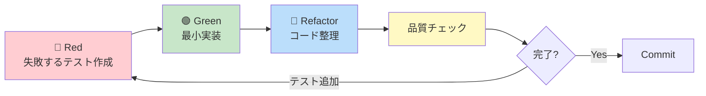
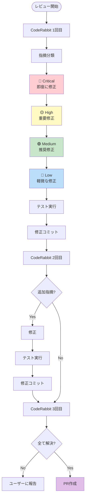

# Yahoo Auction Scraper 開発ワークフロー

## 全体フロー図

```mermaid
flowchart TD
    Start([開発開始]) --> Phase1[Phase 1: 仕様書作成]

    Phase1 --> Req[requirements.md<br/>要件定義]
    Req --> Design[design.md<br/>設計書]
    Design --> Tasks[tasks.md<br/>タスクリスト]

    Tasks --> Phase2[Phase 2: TDD開発サイクル<br/>/tdd-cycle]

    Phase2 --> Worktree[Worktree自動作成<br/>独立作業環境]
    Worktree --> Red[🔴 Red<br/>失敗するテストを書く]
    Red --> Green[🟢 Green<br/>最小実装でテストパス]
    Green --> Refactor[🔵 Refactor<br/>コード整理・最適化]

    Refactor --> Phase3[Phase 3: 品質チェック<br/>/quality-check]

    Phase3 --> QC1[1. Black<br/>コードフォーマット]
    QC1 --> QC2[2. Ruff<br/>Lint & Import]
    QC2 --> QC3[3. pytest<br/>全テスト実行]
    QC3 --> QC4[4. Coverage<br/>95%以上確認]
    QC4 --> QC5[5. bandit<br/>セキュリティスキャン]
    QC5 --> QC6[6. pip-audit<br/>脆弱性チェック]

    QC6 --> QCCheck{全てパス?}
    QCCheck -->|No| QCFix[修正]
    QCFix --> Phase3
    QCCheck -->|Yes| Phase4[Phase 4: AIレビュー & PR<br/>/rabbit-rocket]

    Phase4 --> CR1[CodeRabbit 1回目]
    CR1 --> Fix1[全指摘修正<br/>Critical → High → Medium → Low]
    Fix1 --> CR2[CodeRabbit 2回目]
    CR2 --> Check2{追加指摘?}
    Check2 -->|Yes| Fix2[修正]
    Fix2 --> CR3[CodeRabbit 3回目]
    Check2 -->|No| CR3
    CR3 --> Push[リモートへPush]
    Push --> PR[PR作成 → develop]

    PR --> End([完了])

    style Phase1 fill:#e1f5ff
    style Phase2 fill:#fff4e1
    style Phase3 fill:#e8f5e1
    style Phase4 fill:#ffe1f5
    style Red fill:#ffcdd2
    style Green fill:#c8e6c9
    style Refactor fill:#bbdefb
```



## TDDサイクル詳細



## 品質チェックフロー


## CodeRabbitレビューフロー



## 主要コマンド

### 開発サイクル

```bash
# 1. タスク実装開始（TDD開発）
/tdd-cycle <spec-name> <task-id> [branch-name] "<プロンプト>"

# 2. 品質チェック（6段階チェック）
/quality-check

# 3. AIレビュー & PR作成
/rabbit-rocket
```

### 使用例

```bash
# 仕様書「seller-data」のタスク1を実装
/tdd-cycle seller-data 1 "出品者データ取得機能を実装"

# 品質チェック実行
/quality-check

# CodeRabbitレビュー & PR作成
/rabbit-rocket
```

## 開発原則

### TDD原則

- **Red-Green-Refactor**: テスト先行で開発
- **テスト修正禁止**: テスト失敗時は実装を修正
- **高カバレッジ**: 95%以上のテストカバレッジ必須

### 品質基準

- **型ヒント必須**: 全ての関数に型アノテーション
- **Docstring必須**: Google Style形式
- **セキュリティ**: 認証情報のハードコード禁止
- **パフォーマンス**: 30秒/出品者以下

### コードレビュー基準

- **🔴 Critical**: セキュリティ、アーキテクチャ違反 → 即座に修正
- **🟡 High**: テスト不足、品質基準未達 → 重要修正
- **🟢 Medium**: 命名規則、リファクタリング → 推奨修正
- **🔵 Low**: タイポ、コメント → 軽微な修正
