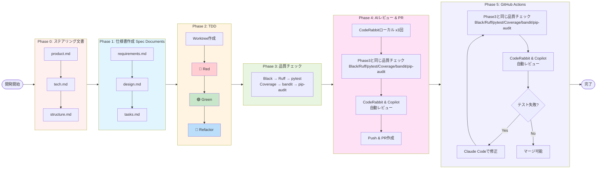

# Yahoo Auction Scraper 開発ワークフロー

## 全体フロー図

```mermaid
flowchart LR
    Start([開発開始]) --> P0

    subgraph P0[Phase 0: ステアリング文書]
        direction TB
        Product[product.md] --> Tech[tech.md] --> Structure[structure.md]
    end

    P0 --> P1

    subgraph P1[Phase 1: 仕様書作成 Spec Documents]
        direction TB
        Req[requirements.md] --> Design[design.md] --> Tasks[tasks.md]
    end

    P1 --> P2

    subgraph P2[Phase 2: TDD]
        direction TB
        Worktree[Worktree作成] --> Red[🔴 Red] --> Green[🟢 Green] --> Refactor[🔵 Refactor]
    end

    P2 --> P3

    subgraph P3[Phase 3: 品質チェック]
        direction TB
        QC[Black → Ruff → pytest<br/>Coverage → bandit → pip-audit]
    end

    P3 --> P4

    subgraph P4[Phase 4: AIレビュー & PR]
        direction TB
        CR[CodeRabbitローカル x3回] --> P4_QC[Phase3と同じ品質チェック<br/>Black/Ruff/pytest/Coverage/bandit/pip-audit] --> P4_Review[CodeRabbit & Copilot<br/>自動レビュー] --> Push[Push & PR作成]
    end

    P4 --> P5

    subgraph P5[Phase 5: GitHub Actions]
        direction TB
        P5_Test[Phase3と同じ品質チェック<br/>Black/Ruff/pytest/Coverage/bandit/pip-audit] --> P5_Review[CodeRabbit & Copilot<br/>自動レビュー]
        P5_Review --> P5_Fix{テスト失敗?}
        P5_Fix -->|Yes| P5_Claude[Claude Codeで修正]
        P5_Claude --> P5_Test
        P5_Fix -->|No| P5_Merge[マージ可能]
    end

    P5 --> End([完了])

    style P0 fill:#fff0f0
    style P1 fill:#e1f5ff
    style P2 fill:#fff4e1
    style P3 fill:#e8f5e1
    style P4 fill:#ffe1f5
    style P5 fill:#f0f0ff
    style Red fill:#ffcdd2
    style Green fill:#c8e6c9
    style Refactor fill:#bbdefb
```
