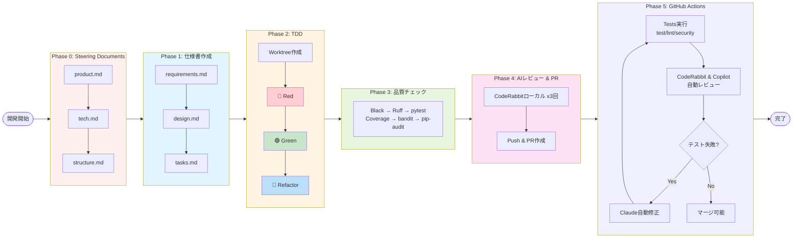
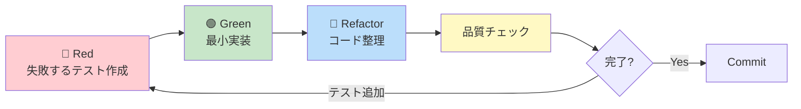
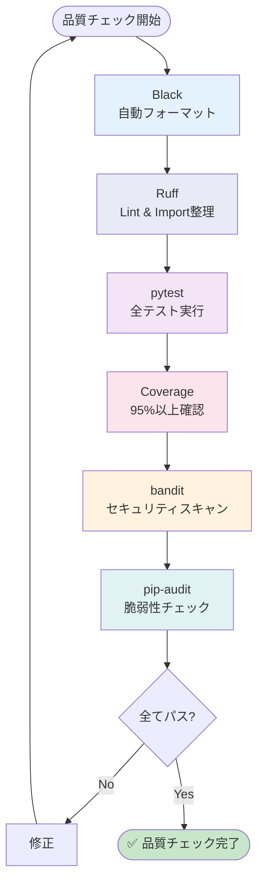

# Yahoo Auction Scraper 開発ワークフロー

## 全体フロー図

```mermaid
flowchart LR
    Start([開発開始]) --> P0

    subgraph P0[Phase 0: Steering Documents]
        direction TB
        Product[product.md] --> Tech[tech.md] --> Structure[structure.md]
    end

    P0 --> P1

    subgraph P1[Phase 1: 仕様書作成]
        direction TB
        Req[requirements.md] --> Design[design.md] --> Tasks[tasks.md]
    end

    P1 --> P2

    subgraph P2[Phase 2: TDD]
        direction TB
        Worktree[Worktree作成] --> Red[🔴 Red] --> Green[🟢 Green] --> Refactor[🔵 Refactor]
    end

    P2 --> P3

    subgraph P3[Phase 3: 品質チェック]
        direction TB
        QC[Black → Ruff → pytest<br/>Coverage → bandit → pip-audit]
    end

    P3 --> P4

    subgraph P4[Phase 4: AIレビュー & PR]
        direction TB
        CR[CodeRabbitローカル x3回] --> Push[Push & PR作成]
    end

    P4 --> P5

    subgraph P5[Phase 5: GitHub Actions]
        direction TB
        GH_Test[Tests実行<br/>test/lint/security] --> GH_Review[CodeRabbit & Copilot<br/>自動レビュー]
        GH_Review --> GH_Fix{テスト失敗?}
        GH_Fix -->|Yes| GH_Claude[Claude自動修正]
        GH_Claude --> GH_Test
        GH_Fix -->|No| GH_Merge[マージ可能]
    end

    P5 --> End([完了])

    style P0 fill:#fff0f0
    style P1 fill:#e1f5ff
    style P2 fill:#fff4e1
    style P3 fill:#e8f5e1
    style P4 fill:#ffe1f5
    style P5 fill:#f0f0ff
    style Red fill:#ffcdd2
    style Green fill:#c8e6c9
    style Refactor fill:#bbdefb
```

## TDDサイクル詳細

```mermaid
flowchart LR
    Red[🔴 Red<br/>失敗するテスト作成] --> Green[🟢 Green<br/>最小実装]
    Green --> Refactor[🔵 Refactor<br/>コード整理]
    Refactor --> QC[品質チェック]
    QC --> Done{完了?}
    Done -->|テスト追加| Red
    Done -->|Yes| Commit[Commit]

    style Red fill:#ffcdd2
    style Green fill:#c8e6c9
    style Refactor fill:#bbdefb
    style QC fill:#fff9c4
```

## 品質チェックフロー

```mermaid
flowchart TD
    Start([品質チェック開始]) --> Black[Black<br/>自動フォーマット]
    Black --> Ruff[Ruff<br/>Lint & Import整理]
    Ruff --> Pytest[pytest<br/>全テスト実行]
    Pytest --> Coverage[Coverage<br/>95%以上確認]
    Coverage --> Bandit[bandit<br/>セキュリティスキャン]
    Bandit --> Audit[pip-audit<br/>脆弱性チェック]

    Audit --> Check{全てパス?}
    Check -->|No| Fix[修正]
    Fix --> Start
    Check -->|Yes| OK([✅ 品質チェック完了])

    style Black fill:#e3f2fd
    style Ruff fill:#e8eaf6
    style Pytest fill:#f3e5f5
    style Coverage fill:#fce4ec
    style Bandit fill:#fff3e0
    style Audit fill:#e0f2f1
    style OK fill:#c8e6c9
```

## CodeRabbitレビューフロー

```mermaid
flowchart TD
    Start([レビュー開始]) --> Review1[CodeRabbit 1回目]

    Review1 --> Class1[指摘分類]
    Class1 --> Critical[🔴 Critical<br/>即座に修正]
    Critical --> High[🟡 High<br/>重要修正]
    High --> Medium[🟢 Medium<br/>推奨修正]
    Medium --> Low[🔵 Low<br/>軽微な修正]

    Low --> Test1[テスト実行]
    Test1 --> Commit1[修正コミット]

    Commit1 --> Review2[CodeRabbit 2回目]
    Review2 --> Check2{追加指摘?}

    Check2 -->|Yes| Fix2[修正]
    Fix2 --> Test2[テスト実行]
    Test2 --> Commit2[修正コミット]
    Commit2 --> Review3[CodeRabbit 3回目]

    Check2 -->|No| Review3

    Review3 --> Final{全て解決?}
    Final -->|No| Report[ユーザーに報告]
    Final -->|Yes| PR[PR作成]

    style Critical fill:#ffcdd2
    style High fill:#fff9c4
    style Medium fill:#c8e6c9
    style Low fill:#bbdefb
    style PR fill:#e1bee7
```
